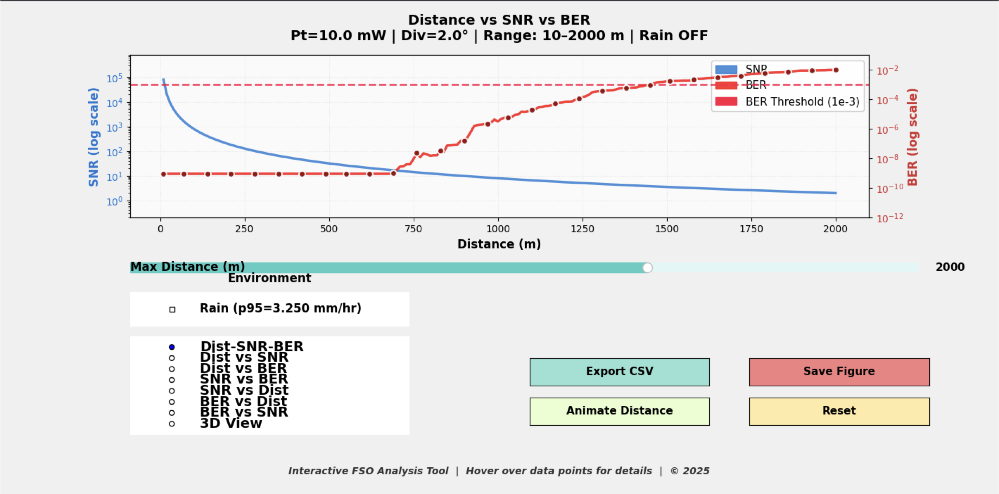
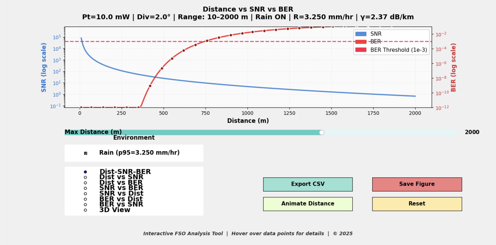
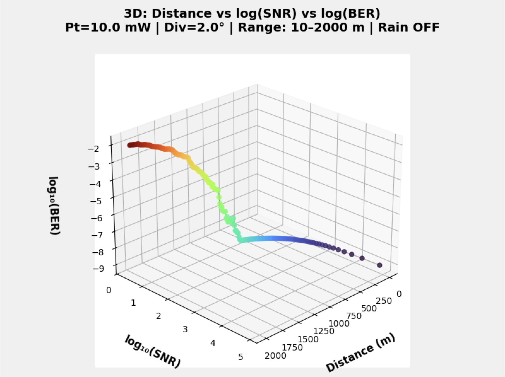

# ML-based Performance Prediction and Optimization of FSO Links
An end-to-end **Free Space Optics (FSO)** analysis toolkit that combines:
- **physics-inspired link modeling** (received power → SNR → BER),
- a trained **ML surrogate model** (Random Forest) for fast BER prediction, and
- an **interactive desktop dashboard** (Matplotlib widgets) for exploring performance trade-offs across distance / power / divergence, with an optional **rain attenuation mode** driven by real rainfall data.

> **Disclaimer (Important):** This project is for educational/research experimentation only. Results depend on the chosen link model assumptions and parameters.

---

## What this project does
FSO systems can deliver high data rates, but their performance degrades with distance and weather conditions. This project lets you:
- **Predict BER quickly** using a trained ML model instead of running full simulations every time.
- **Visualize key relationships** (Distance ↔ SNR, BER ↔ SNR, Distance ↔ BER, 3D surfaces).
- **Explore rain impact** using your rainfall dataset by applying rain attenuation to the link budget (SNR drops → BER rises).

---

## Highlights
- **ML surrogate model:** RandomForestRegressor trained on **3,000 synthetic FSO link scenarios**  
- **Strong accuracy:** **RMSE ≈ 4.07×10⁻⁴**, **MAE ≈ 1.42×10⁻⁴**, **R² ≈ 0.993** (held-out test split)
- **Interactive analysis GUI:** sliders + toggles + live plot updates (Matplotlib widgets)
- **Rain-aware visualization:** reads rainfall CSV (2014–2024) → converts to rain rate → applies power-law attenuation → recomputes SNR/BER

---

## Repo contents
- `build_and_train_fsober_model.py` — generate synthetic dataset + train model + save artifact
- `fsomodel_rf.joblib` — saved Random Forest model artifact
- `predict_ber.py` — CLI demo: predict BER for distance(s) and plot
- `interactive_fso_demo.py` — interactive GUI (clear-air mode)
- `interactive_fso_demo_with_rain.py` / `interactive_fso_demo_with_rain_responsive.py` — interactive GUI with rain toggle
- `CCS_20140101_20240101 (1).csv` — rainfall dataset used for rain statistics
- `ber_true_vs_pred.png` — model quality plot (true vs predicted)

---

## Screenshots 




---

## Tech stack
- Python 3.9+ (3.11 recommended)
- NumPy, Pandas
- scikit-learn, joblib
- Matplotlib (+ widgets)
- mplcursors (tooltips)

---

## Quickstart

### 1) Create environment & install deps
```bash
python -m venv .venv
# mac/linux
source .venv/bin/activate
# windows (powershell)
# .\.venv\Scripts\Activate.ps1

pip install -U pip
pip install -r requirements.txt

# requirements.txt in this repo is minimal.
# If you get import errors, install the full set below:
pip install pandas scikit-learn joblib mplcursors
